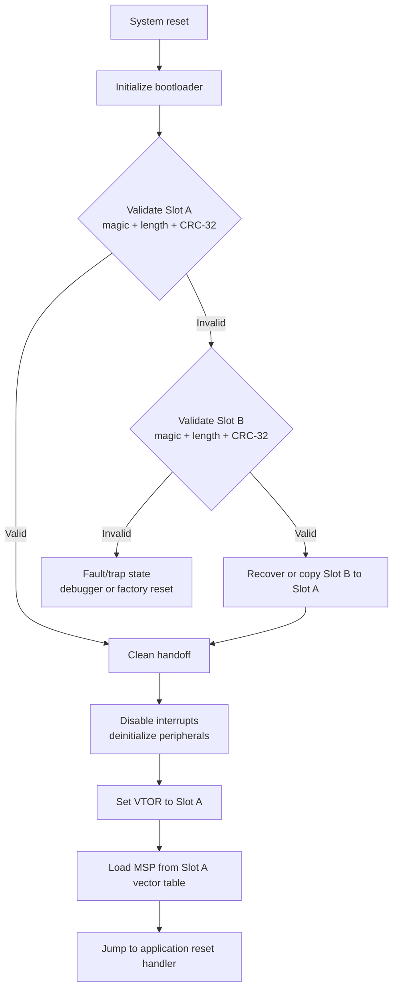

# Secure A/B Bare-Metal Bootloader for STM32F446RE

A resilient, fail-safe bootloader implementation for the **ARM Cortex-M4 (STM32F446RE)** designed to prevent device bricking during firmware updates. It features **A/B Dual-Slot Partitioning**, **CRC-32 Image Integrity Verification**, and **Automatic Rollback Capabilities** to ensure high-availability operation.

---

## 🚀 Key Features

- **Dual-Bank (A/B) Partitioning:** Maintains active and staging/backup execution slots.
- **Fail-Safe Rollback Logic:** Automatically falls back to a verified image if an update is corrupted or fails runtime integrity.
- **CRC-32 Integrity Verification:** Computes software/hardware checksums against metadata embedded in the firmware binary before execution.
- **Clean System Handoff:** Restores MCU peripherals, resets interrupt configurations, re-maps the Main Stack Pointer (MSP), and updates the Vector Table Offset Register (VTOR) prior to execution.
- **Bare-Metal Efficiency:** Written directly in Embedded C utilizing CMSIS headers without high-overhead RTOS abstractions.

---

## 🛠️ Tech Stack & Hardware

| Component | Details |
| --- | --- |
| **Microcontroller** | STM32F446RE (ARM Cortex-M4 @ 180 MHz) |
| **Language** | Embedded C, ARM Assembly (Startup) |
| **IDE / Toolchain** | STM32CubeIDE / GNU ARM Embedded Toolchain |
| **Libraries** | CMSIS Core / STM32F4 HAL |
| **Utilities** | Python 3 (CRC-32 Post-Build Insertion Script) |

---

## 📐 Memory Map & Flash Partitioning

The internal 512 KB Flash memory of the STM32F446RE is partitioned into clear boundaries aligned with physical sector sizes to prevent data loss during flash sector erase operations:

| Memory Region | Physical Sectors | Address Range | Size | Description |
| :--- | :--- | :--- | :--- | :--- |
| **Bootloader** | Sectors 0–1 | `0x08000000` – `0x08007FFF` | 32 KB | Primary boot execution & rollback logic |
| **Slot A (Active)** | Sectors 2–5 | `0x08008000` – `0x08067FFF` | 384 KB | Primary user application execution slot |
| **Slot B (Backup/Staging)** | Sectors 6–7 | `0x08068000` – `0x080C7FFF` | 384 KB | Staging zone for new updates & rollback backup |

> **Note:** Slot A and Slot B share the same 384 KB size constraint. The bootloader ensures only one slot is active at a time, with Slot B serving as a safe staging area for OTA or wired updates.

---

## 🏷️ Metadata Field Structure

Applications must be prepended with the following metadata header so the bootloader can perform runtime safety checks:

| Field Offset | Field Name | Type | Description |
| :--- | :--- | :--- | :--- |
| `+0x00` | **Magic Pattern 0** | `uint32_t` | Header start identifier (`0xFF01FF02`) |
| `+0x04` | **Magic Pattern 1** | `uint32_t` | Header start identifier (`0xFF03FF04`) |
| `+0x08` | **Image Length** | `uint32_t` | Binary size in bytes |
| `+0x0C` | **CRC-32 Checksum** | `uint32_t` | Calculated hash populated post-build |
| `+0x10` | **Git Commit Hash** | `uint32_t` | Unique build version tag |

### Post-Build Script

A Python 3 script (`scripts/append_crc.py`) is provided to automatically:

1. Calculate the CRC-32 of the compiled binary.
2. Inject the metadata header at the specified offset.
3. Output a flash-ready `.bin` file.

---

## 🔄 Bootloader Workflow



### Boot Decision Logic

1. **Primary Check:** Validate Slot A (magic patterns + CRC-32 match).
2. **If Slot A Invalid:** Validate Slot B.

- If Slot B is valid, copy it to Slot A (rollback/recovery).
- If both slots are invalid, enter a fault/trap state (requires debugger or factory reset).

3. **Handoff:** Once a valid image is confirmed in Slot A, perform a clean boot:

- Disable global interrupts.
- De-initialize used peripherals.
- Set VTOR to Slot A base address.
- Load MSP from Slot A vector table.
- Jump to the application reset handler.

---


## 🔧 Building & Flashing

### Prerequisites

- STM32CubeIDE or GNU ARM Embedded Toolchain
- Python 3.8+
- ST-Link V2 or compatible debugger

### Build Steps

1. Open the project in STM32CubeIDE or build via Makefile:

```bash
   make clean && make
```

2. Run the post-build script to inject metadata:

```bash
   python3 scripts/append_crc.py build/app.bin build/app_flashable.bin
```

3. Flash the bootloader:

```bash
   st-flash write build/bootloader.bin 0x08000000
```

4. Flash the application to Slot A (or B for staging):

```bash
   st-flash write build/app_flashable.bin 0x08008000  # Slot A
```

---

## 🧪 Testing Rollback

To verify the fail-safe mechanism:

1. Flash a valid application to **Slot A**.
2. Flash a corrupted or intentionally invalid image to **Slot B** (or corrupt Slot A's metadata).
3. Trigger a system reset.
4. Observe that the bootloader detects the corruption and either rolls back from Slot B or traps safely.

---

## 📜 License

MIT License — See [LICENSE](LICENSE) for details.

---

## 🤝 Contributing

Contributions are welcome! Please open an issue or submit a pull request for bug fixes, feature additions, or documentation improvements.